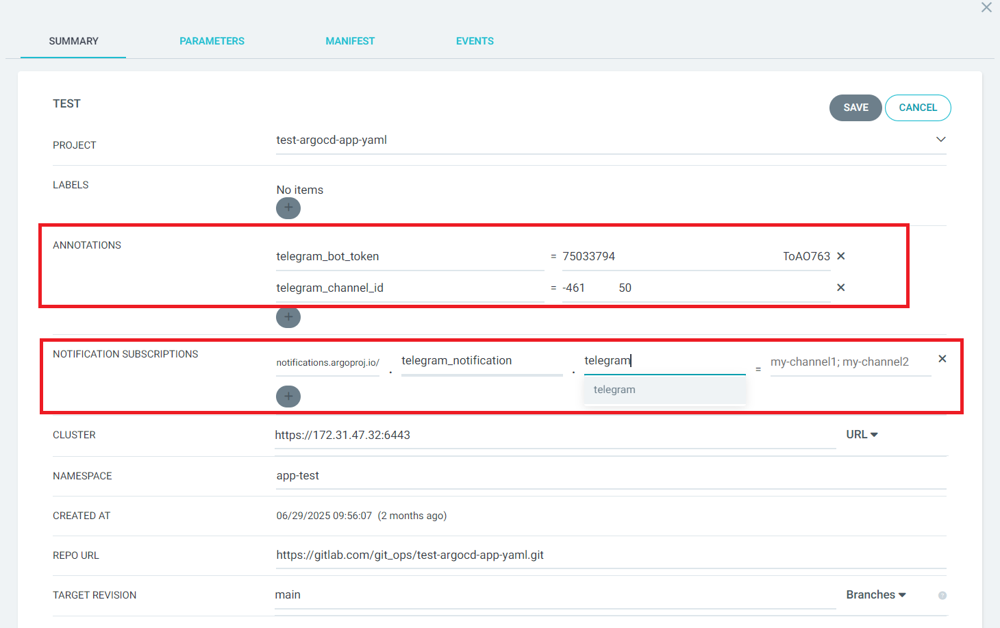

# Argocd telegram notification with custom specify telegram bot token and channel ID in annotations when sync applications

| Template Manifest |
| :--- |
| argocd-notifications-cm.yaml  |

> [!TIP]
> Can customize and redefine information based on my template.

## Quick Deploy
```
# kubectl replace -f argocd-notifications-cm.yaml -n <ARGOCD_DEPLOYED_NAMESPACE>
```

## Set Notification Subscriptions, Bot Token & ChannelID To Annotations Of ArgoCD Applications To Trigger Notification
**Turtorial:**


| Field | Key | VALUE |
| :--- | :--- | :--- |
| **ANNOTATIONS** | **telegram_bot_token** | **<TELEGRAM_BOT_TOKEN>** |
| **ANNOTATIONS** | **telegram_channel_id** | **<TELEGRAM_CHANNEL_ID>** |
| **NOTIFICATION SUBSCRIPTIONS** | **notifications.argoproj.io/telegram_notification.telegram** | **<BLANK>** |

## Result After Set Notification Subscriptions, Bot Token & ChannelID

